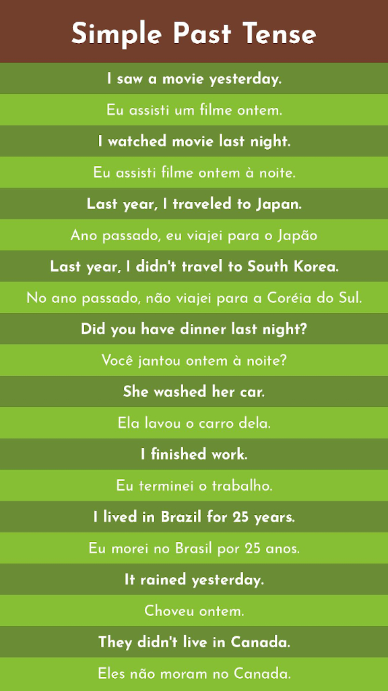

## Flashcard Generator
Creates a flashcard model to help you to study another language. The model look like this:
 

 
It's a colored flashcard with title field on top, and a set of text field for sentences.

### How to use it
You'll choose the title, create a sentence list up to 20 sentences, create a FCColor object with the colors that you want or choose from src/colors_const.py. Create a FlashCard instance and populate with our previous data and choose a file path and save it with the save method, that will create a JPG file.

### In Development
An Open Document format for to generate .fodg files. This future option will allow to use LibreOffice and and consequently all its exports formats.
